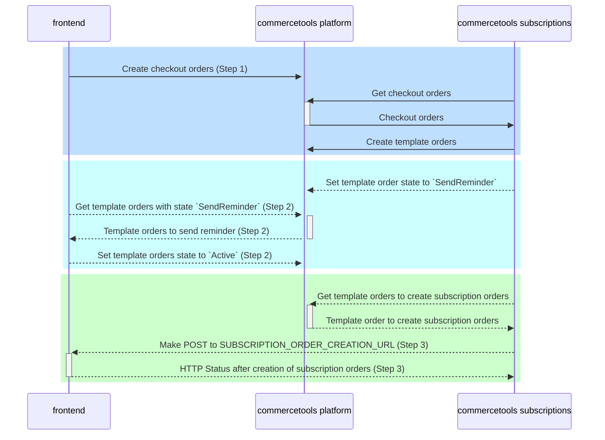

# Integration guide

<!-- START doctoc generated TOC please keep comment here to allow auto update -->
<!-- DON'T EDIT THIS SECTION, INSTEAD RE-RUN doctoc TO UPDATE -->

# Table of Contents

- [Terminology](#terminology)
- [Before you begin](#before-you-begin)
- [Sequence diagram](#sequence-diagram)
- [Step 1: Create a checkout order with subscriptions](#step-1-create-a-checkout-order-with-subscriptions)
  - [Checkout order custom fields:](#checkout-order-custom-fields)
  - [Checkout line item custom fields](#checkout-line-item-custom-fields)
- [Step 2: Send reminder (Optional)](#step-2-send-reminder-optional)
- [Step 3: Generate a subscription order](#step-3-generate-a-subscription-order)
  - [Subscription order custom fields](#subscription-order-custom-fields)
- [Non-recoverable error](#non-recoverable-error)

<!-- END doctoc generated TOC please keep comment here to allow auto update -->

## Terminology

- **user**: the one who is responsible for running `commercetools-subscriptions` and `frontend`.
- **customer**: the one who buy goods from the user.
- **checkout-order**: an order which customers create during the checkout. It may contain one or more subscriptions. `commercetools-subscriptions` will generate a **template-order** for every subscription.
- **frontend**: application (usually an e-shop) of a user that is responsible for generating checkout orders.
- **template-order**: an order which manages a single subscription and is used as a template to create a
  subscription-order.
- **subscription-order**: a new order (actual delivery) triggered by the template order according to the defined schedule.

## Before you begin

Create all the required custom types and states located in [resources folder](./resources). Check [project requirements](./docs/HowToRun.md#commercetools-project-requirements) for more details.

## Sequence diagram

This diagram contains all the interactions between participants frontend, commercetools subscriptions and commercetools platform. For frontend integration only the interactions noted with Step 1, Step 2 and Step 3 are required.



## Step 1: Create a checkout order with subscriptions

`commercetools-subscriptions` processes only orders with subscription line items.

<details>
<summary> Click to expand an example order draft. In
the example, there is 1 subscription line item for wine and 1 line item for pants</summary>

```
{
  "orderNumber": "10000",
  "customerEmail": "test@test.com",
  "totalPrice": {
    "currencyCode": "EUR",
    "centAmount": 18000
  },
  "lineItems": [
    {
      "name": {
        "en": "Wine subscription"
      },
      "variant": {
        "sku": "wine01"
      },
      "price": {
        "value": {
          "type": "centPrecision",
          "currencyCode": "EUR",
          "centAmount": 18000,
          "fractionDigits": 2
        },
        "country": "DE"
      },
      "quantity": 1,
      "custom": {
        "type": {
          "typeId": "type",
          "key": "checkout-order-line-item"
        },
        "fields": {
          "cutoffDays": 5,
          "reminderDays": 5,
          "subscriptionKey": "UNIQUE_SUBSCRIPTION_KEY",
          "isSubscription": true,
          "schedule": "0 0 1 Feb,May,Aug,Nov *"
        }
      }
    },
    {
      "name": {
        "en": "Pants"
      },
      "variant": {
        "sku": "pants"
      },
      "price": {
        "value": {
          "type": "centPrecision",
          "currencyCode": "EUR",
          "centAmount": 8000,
          "fractionDigits": 2
        },
        "country": "DE"
      },
      "quantity": 1
    }
  ],
  "custom": {
    "type": {
      "typeId": "type",
      "key": "checkout-order"
    },
    "fields": {
      "hasSubscription": true
    }
  }
}
```

</details>

Checkout order with subscriptions contains following custom fields:

### Checkout order custom fields:

| Name                    | Type    | Description                                                                                                                           | Required |
| ----------------------- | ------- | ------------------------------------------------------------------------------------------------------------------------------------- | -------- |
| hasSubscription         | boolean | True if the order contains line items that should be processed as subscriptions                                                       | YES      |
| isSubscriptionProcessed | boolean | True if the order has already been processed by `commercetools-subscriptions.` This attribute is set by `commercetools-subscriptions` | NO       |

### Checkout line item custom fields

| Name            | Type    | Description                                                                                                                                                                                             | Required |
| --------------- | ------- | ------------------------------------------------------------------------------------------------------------------------------------------------------------------------------------------------------- | -------- |
| isSubscription  | boolean | True if the line item represents a subscription                                                                                                                                                         | YES      |
| schedule        | String  | Cron syntax which defines the trigger cycle of the subscription-order                                                                                                                                   | YES      |
| subscriptionKey | String  | It will be used to generate unique orderNumber(s) for the template orders. It has to be unique across all commercetools order API lineItems.                                                            | YES      |
| reminderDays    | Number  | Defines the amount of days the reminder should be triggered before the next delivery                                                                                                                    | NO       |
| cutoffDays      | Number  | If the amount of days since placing of the checkout-order until the next scheduled subscription order is equal or smaller than cutoffDays then the next closest subscription-order creation is skipped. | NO       |

cutoffDays: This setting allows omitting scenarios where a customer gets 2 subscription deliveries within a very short period if the checkout-order has been placed shortly before the next scheduled period begins.
Example: Let's assume we trigger a subscription-order every 1st of February and 1st of May, cutoffDays is set to 15:

- If the checkout-order was placed until 15 of January then the next subscription-order creation is planned for the 1st of February.
- If the checkout-order was placed between 16 - 31 of January then the next subscription-order creation is planned for the 1st of May.

## Step 2: Send reminder (Optional)

If the checkout order was created with an option `reminderDays`, `commercetools-subscriptions` sets `nextReminderDate` when generating the template order. When `nextReminderDate` is the current date, `commercetools-subscriptions` will change [custom state](https://docs.commercetools.com/api/projects/states) of the template order from `Active` to `SendReminder`.

<details>
<summary>Changing the state will generate a message similar to the example below.</summary>
```
{
      "id": "136b15c1-6c26-4a9f-85fe-b5f68a42eaf9",
      "version": 1,
      "sequenceNumber": 4,
      "resource": {
        "typeId": "order",
        "id": "1cfb3b98-3f82-4fea-aaa0-004614cc008d"
      },
      "resourceVersion": 4,
      "resourceUserProvidedIdentifiers": {
        "orderNumber": "YOUR_ORDER_NUMBER"
      },
      "type": "OrderStateTransition",
      "state": {
        "typeId": "state",
        "id": "361fabd1-fed1-43be-9610-b7c63937342c"
      },
      "oldState": {
        "typeId": "state",
        "id": "09015358-70e9-4025-b4b6-3febcaaf06de"
      },
      "force": false
}
```
</details>

It is up to the user to consume this message and send a reminder email to the customer. To consume messages, user has 2 options:

- [Create a Subscription](https://docs.commercetools.com/api/projects/subscriptions#create-a-subscription) for messages of type [`OrderStateTransition`](https://docs.commercetools.com/api/message-types#orderstatetransitionmessage)
- Query for the messages of type `OrderStateTransition` using [Messages endpoint](https://docs.commercetools.com/api/projects/messages)

Be aware that `commercetools-subscriptions` do not send any reminders, it only set custom state of the order.

After user processes the message, user has to [make a transition](https://docs.commercetools.com/api/projects/orders#transition-state) to the new order custom state `key="commercetools-subscriptions-reminderSent"`

## Step 3: Generate a subscription order

`commercetools-subscriptions` sets `nextDeliveryDate` when generating the template order. When `nextDeliveryDate` is the current date, `commercetools-subscriptions` will make a **POST** request to the URL sets using env var `SUBSCRIPTION_ORDER_CREATION_URL` with the following body payload:

```json
{ "templateOrderId": "id-of-the-template-order" }
```

The receiver of the body payload uses `templateOrderId` to fetch the template order and create a subscription order. The subscription order must have generated unique `orderNumber`, correct payments and setting all the information required by the merchant for the further processing. For subscription order creation we recommend using [Order import API](https://docs.commercetools.com/api/projects/orders-import#orderimportdraft). On order creation make sure you have a successful payment and required fields `subscriptionTemplateOrderRef` and `deliveryDate` (value copied from the nextDeliveryDate) from the template order are set.

After finishing the subscription order creation process, the receiver of the payload must return one of the following HTTP code depending on the result of the subscription order creation process:

| Result of the subscription order creation process                                  | HTTP status code    | Follow-up action in `commercetools-subscriptions`                                                                                                                                                                |
| ---------------------------------------------------------------------------------- | ------------------- | ---------------------------------------------------------------------------------------------------------------------------------------------------------------------------------------------------------------- |
| Subscription order was created successfully                                        | 200                 | Template order gets new `nextDeliveryDate`, new `nextReminderDate` and order custom state is `Active`                                                                                                            |
| Unexpected error during processing the subscription order                          | 5xx                 | Template order is skipped and processing will be repeated with the next run of `commercetools-subscriptions`                                                                                                     |
| Problem with authentication and authorization to `SUBSCRIPTION_ORDER_CREATION_URL` | 401, 403            | Template order is skipped and processing will be repeated with the next run of `commercetools-subscriptions`                                                                                                     |
| Any other errors during processing                                                 | 4xx except 401, 403 | Template order custom state is set to `ERROR`. This order is not processed anymore and user must [make a state transition](https://docs.commercetools.com/api/projects/orders#transition-state) back to `ACTIVE` |

In case of any network issues `commercetools-subscriptions` will skip the template order and processing will be repeated with the next run.

### Subscription order custom fields

| Name                         | Type      | Description                                                                                                                                                      | Required |
| ---------------------------- | --------- | ---------------------------------------------------------------------------------------------------------------------------------------------------------------- | -------- |
| subscriptionTemplateOrderRef | Reference | Reference to the template order                                                                                                                                  | YES      |
| deliveryDate                 | Date      | Copy of the nextDeliveryDate from the template order. The purpose of this field is to avoid (in some error cases) the creation of duplicate subscription orders. | YES      |

## Non-recoverable error

Following error message indicates a situation when recovery cannot be done by retrying.

> Template order ${orderNumber}: Unrecoverable error received when calling ${subscriptionOrderCreationUrl}. Please check the order and set its state back to "Active". Response status code ${response.status}

This error can happen when calling the URL sets using the env var `SUBSCRIPTION_ORDER_CREATION_URL`. According to the returned HTTP Status code following issues could happen:

| HTTP Status code | Possible error                                             | Possible solution                                                                                                                                                                    |
| ---------------- | ---------------------------------------------------------- | ------------------------------------------------------------------------------------------------------------------------------------------------------------------------------------ |
| 5xx              | Error inside the application generating subscription order | Check for errors in your application that is serving response for `SUBSCRIPTION_ORDER_CREATION_URL`                                                                                  |
| 401, 403         | Authentication error                                       | Check if the env variables `BASIC_AUTH_USERNAME`, `BASIC_AUTH_PASSWORD` and `CUSTOM_HEADERS` contain correct credentials. If not, fix them and restart `commercetools-subscriptions` |

In case of error `commercetools-subscriptions` will set the custom state of the template order to `ERROR`. The user has to manually check and fix the problem and afterwards [make a custom order state transition](https://docs.commercetools.com/api/projects/orders#transition-state) to `ACTIVE`, so that the order could be retried again.
